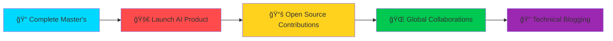

<div align="center">

# 👋 Hello, I'm Ahmad Jajan


</div>

<div align="center">
  
[](https://linkedin.com/in/ahmadjajan)
[](https://portfolio-mcsn2c4dfbcfsmhgj7yrsq.streamlit.app/)
[](mailto:your.email@example.com)

</div>

---


### 🚀 About Me
```python
class AhmadJajan:
    def __init__(self):
        self.name = "Ahmad Jajan"
        self.role = "AI Engineer"
        self.location = "🌍 Global"
        self.education = "🎓 Master's in Generative AI"
        self.interests = ["LLMs", "Agent Systems", "RAG", "Computer Vision"]
    
    def say_hi(self):
        print("Building intelligent systems, one model at a time!")

me = AhmadJajan()
me.say_hi()
```

- 🔭 Currently building **AI-powered applications** with LangChain & LLMs
- 🌱 Deep diving into **Agent Orchestration** and **Multi-Agent Systems**
- 💡 Passionate about **Generative AI**, **Prompt Engineering**, and **RAG**
- 🎯 2025 Goal: Launch my own **AI SaaS product**
- ⚡ Fun fact: I debug with coffee and solve problems with AI ☕🤖

<br clear="right"/>

---

## 🛠️ Tech Arsenal

<div align="center">

### **AI & Machine Learning**


### **Frameworks & Tools**


### **Development & DevOps**


</div>

---

## 🎯 Featured Projects

<div align="center">

<table>
<tr>
<td width="50%">

### 🤖 Multiverse Agent Simulator
**AI agents making real-time decisions**

[](https://github.com/ahmedjajan93/portfolio)

- Multi-agent orchestration with LangChain
- Strategic decision-making AI
- Real-time scenario simulation

**Tech:** Python • LangChain • OpenAI • Streamlit

</td>
<td width="50%">

### 💬 AI Meeting Assistant
**Smart transcription & summarization**

[](https://github.com/ahmedjajan93/AI-Meeting-Assistant)

- Real-time audio transcription
- AI-powered meeting summaries
- Action item extraction

**Tech:** Python • Whisper • GPT-4 • FastAPI

</td>
</tr>

<tr>
<td width="50%">

### 🎯 AI Portfolio Hub
**Showcasing AI innovation**

[](https://portfolio-mcsn2c4dfbcfsmhgj7yrsq.streamlit.app/)

- Interactive project showcase
- Live AI demonstrations
- Technical deep-dives

**Tech:** Streamlit • Python • AI Models

</td>
<td width="50%">

### 🔮 Computer Vision Suite
**Real-time object detection**

[](https://github.com/ahmedjajan93)

- YOLO-based detection
- Real-time video analysis
- Custom model training

**Tech:** Python • YOLO • OpenCV • PyTorch

</td>
</tr>
</table>

</div>

---

## 📊 GitHub Analytics

<div align="center">
  


</div>

<div align="center">
  
[](https://git.io/streak-stats)

</div>

---

## 🏆 GitHub Trophies

<div align="center">
  
[](https://github.com/ryo-ma/github-profile-trophy)

</div>

---

## 🎯 2025 Roadmap


<div align="center">

### 📈 Current Focus Areas

| Focus | Progress | Status |
|-------|----------|--------|
| 🎓 Master's Degree | ████████░░ 80% | In Progress |
| 🚀 AI Product Development | ██████░░░░ 60% | Active |
| 📚 Open Source | ████░░░░░░ 40% | Building |
| 📝 Technical Writing | ███░░░░░░░ 30% | Planning |

</div>

---

## 💭 Latest Blog Posts

<!-- BLOG-POST-LIST:START -->
- 🤖 Building Production-Ready LLM Applications with LangChain
- 🔥 RAG vs Fine-tuning: When to Use What
- 🎯 Multi-Agent Systems: The Future of AI
- 💡 Prompt Engineering Best Practices for GPT-4
<!-- BLOG-POST-LIST:END -->

---

## 🎵 Coding Soundtrack

<div align="center">

[](https://spotify-github-profile.vercel.app/api/view?uid=YOUR_SPOTIFY_ID&redirect=true)

</div>

---

<div align="center">

### 💬 Random Dev Quote


---

### 👀 Profile Views


---

### ☕ Support My Work

If you find my projects useful, consider buying me a coffee!

[](https://www.buymeacoffee.com/ahmadjajan)

</div>

---

<div align="center">
  
### 💡 *"The best way to predict the future is to build it."*

**Let's build something amazing together!** 🚀

</div>
